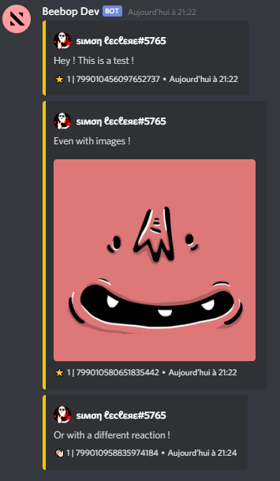

# Starboards-Bot

A complete bot to create and manage starboards on discord using [`discord-starboards`](https://github.com/SimonLeclere/discord-starboards).

## Features

- ⏱️ Easy to use! Create and delete your starboards with simple commands!
- 🔄 Automatic restart after bot crash!
- 📁 Support for all databases! (default is json, see the module documentation)
- 🌐 Support for multiple starboards per server, and even per channels with a different emoji and different options!
- ⚙️ Very customizable! (emoji, threshold, selfstat, botStars, etc... See the module documentation)

## Installation


• Clone repository:
```
git clone https://github.com/SimonLeclere/Starboards-Bot.git
```

• Fill configuration (config.json):
```
{
    "token": "", // Your bot token
    "prefix": "", // The prefix
    "owner": "", // Your id (for the eval command)
    
    "defaultEmoji": "⭐" // The default emoji for starboards (there are many others options with the module)
}
```
• Install dependencies:
```
npm install
```
• Start:
```
node index.js
```

## Screenshots

